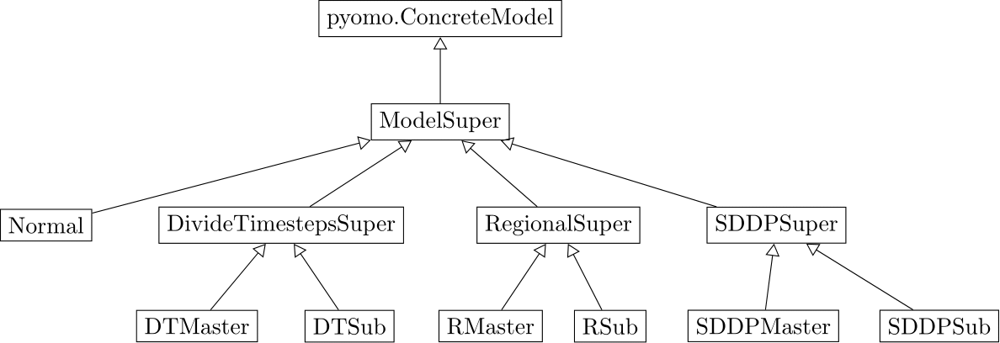

.. _model class structure:

Model Class Structure
---------------------
This section explains how the models are grouped into different classes in the decomposition branch. It also highlights
the differences between the decomposition models and the original model. To understand this section you should be familiar
with the original model. If this does not apply to you, you should have a look at the sections :ref:`overview` and perhaps :ref:`mathdoc` first.

Depending on which of the decomposition methods is used, the models look slightly different.

This is organized in a class structure as follows:

This graphic shows the classes and their inheritance. Classes in a lower level inherit from the classes in the level
above if they are connected by an arrow.

- ModelSuper: Abstract class which unifies the model parts and constraint rules which are the same for all models.
  It inherits from ``pyomo.ConcreteModel``.
- Normal: The urbs model if no decomposition method is used.
- DivideTimestepsSuper, RegionalSuper, SddpSuper: Abstract classes which contain the model parts which are the same for master and sub problems of the respective decomposition method.
- DivideTimestepsMaster, RegionalMaster, SddpMaster: The models for the master instance of the respective decomposition method.
- DivideTimestepsSub, RegionalSub, SddpSub: The models for the sub instances of the respective decomposition method.

It is possible to create instances of the master, sub and normal classes. Instances of the super classes make no sense by
themselves and therefore the classes are abstract.

General Model Structure
^^^^^^^^^^^^^^^^^^^^^^^
For an overview over what kind of sets, variables, parameters and equations can be set in the model see :ref:`overview` and :ref:`mathdoc` for more
in depth explanations. Buy/Sell, Startup and demand site management features are not supported in the decomposition branch as of now.
The modelling ideas which are common to all decomposition methods (and different or new compared to the normal model) are explained in the following sections.
To understand what the specifics of each decomposition method are, key differences between them and the normal model are explained in the sections
:ref:`divide timesteps model`, :ref:`regional model` and :ref:`sddp model`.

Common concepts of decomposition methods
^^^^^^^^^^^^^^^^^^^^^^^^^^^^^^^^^^^^^^^^^^^^

This section explains the parts of decomposition which are the same for all three methods, but different from the normal.
In brief, all decomposition methods have a master problem which optimizes the overall costs. The master problem
outsources some of its variables and therefore costs (``eta`` or future costs) to the sub problems and imposes constraints on these problems.
The goal of each sub problem is to minimize the violation of these constraints to eventually bring them down to zero.
The constraint violation is given by the term ``Lambda`` times ``omega``. This, at the same time, optimizes the costs of
the sub problems, because one of the constraints given by the master problem is on the sub problems costs.
If the sub problem cannot fulfill the constraints given by the master problem, it generates a cut for the master problem,
which "informs" the master problem that the constraints are too tight. In the next iteration the master problem calculates
a new solution with new constraints that consider the new information given by the cuts.

.. _variables:

Sets, Variables, Parameters and Expressions
"""""""""""""""""""""""""""""""""""""""""""""

- Master objective: The master objective is to minimize the costs of the master problem, which are equal to the overall costs.

- Sub and master costs: The costs of the sub problems and the master problem are slightly different for each decomposition method,
  depending on which costs incur in which problem.

- ``eta``/future costs: The variable ``eta`` in the master describes the future cost for each sub problem (the cost that the subproblem is expected to have).
  The sub problems have a variable ``eta_res`` (restriction on eta) which is equal to the variable ``eta`` from the same iteration in the master.
  SDDP is an exception here, because the master problem can only communicate with the first sub problem, so every sub problem has its own ``eta``
  variable which sets the restriction ``eta_res`` for the next sub problem.

- ``Lambda``: The master problem imposes constraints on the sub problems.
  The ``Lambda`` variable of the sub problem is the maximal violation of any such constraints.
  The sub problems objective is to minimize ``Lambda``.
  If ``Lambda`` is zero, this means that the sub problem does not violate any constraints from the master problem.
  This also means that the sub problem does not contribute a new cut to the master problem.
  If ``Lambda`` is zero for all sub problems, no further cuts are added to the master problem,
  so the feasible region of the master problem is known and an optimal solution can be found.

- ``omega``: :math:`(\omega, \omega_0)^T` is called the cost vector. The constraint on the costs of the sub problem may be violated by no more than ``omegazero`` times ``Lambda``,
  while a constraint on any other variable may be violated by no more than ``omega`` times ``Lambda``. This approach allows the sub problems to generate cuts
  which are close (facet cuts) to the feasible solution area of the master problem and thus lead to relatively fast convergence. For Divide Timesteps and SDDP
  we fix both ``omega`` and ``omegazero`` to one which leads to promising results. For regional we also choose both to be one, but every five iterations,
  we set ``omega`` to zero. This has the effect that the sub problems are forced to not make relaxing assumptions
  which in turn leads to the sub problems using the expensive slack power plants and not assumed transmissions from other sites.
  This results in a faster estimation of an upper bound.

- ``dual``: If ``dual`` is true, the dual variable of the pyomo model is set such that the dual variables are saved.

- Capacity rules and parameters: The capacity constraints have a special form:
  :math:`capacity <= cap_{new} + cap_{installed} + cap_{relax}`.
  The advantage of these constraints are that they can be used in the normal, master and sub models by setting
  the involved parameters and expressions correctly.
  E.g. for the normal model ``cap_relax`` is zero, so that the capacity is equal to the installed capacity plus the new capacity.
  To be more exact this holds for all models which are allowed to expand the capacities.
  These are the normal model as well as all master models and the regional sub models.
  In sub problems of Divide Timesteps and SDDP on the other hand, the new capacity and the installed capacity
  are set to the values of the master problem as only the master problem is allowed to expand capacities.
  The parameter ``cap_relax`` though is set to ``omega`` times ``Lambda``, because the sub problems are allowed to violate constraints
  by this amount.

Rules
""""""""

- Objective Rules: The objective rules are the same for all decomposition methods.
  The master optimizes its cost and the sub problem optimize their ``Lambda`` variable.

- ``def_capacity_rules``: Explained in detail in :ref:`variables`

- ``def_capacity_l_rule``: The lower capacity rule is used in Divide Timesteps and SDDP and forces sub problems
  to have at least a certain amount of capacity in the beginning. Although this rule seems not intuitive, it is necessary,
  because even if the sub problem does not need the capacity for itself it still needs to pay the running costs if it is
  installed.

Functions
"""""""""""

- Cut generation: The sub problems generate cuts for the master problem (Divide Timesteps, Regional) or the previous problem (SDDP).
  Cut generation is different for each of the methods.

- Set boundaries: The method :func:`set_boundaries` is used to set a restriction variable in the sub problem (e.g. ``eta_res``) to the corresponding value in the master problem (e.g. ``eta``).

- Wrapper methods: There are a couple of methods that provide a wrapper for the underlying ``pyomo.ConcreteModel``: :func:`get_attribute`, :func:`get_attribute_at`, :func:`get_cost` and
  :func:`get_duals` which are pretty self explanatory from the doc strings. There's also a method :func:`solve` which can be called in the way ``model.solve(solver)``.

