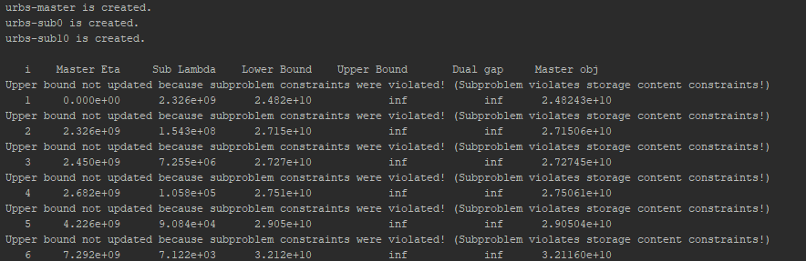
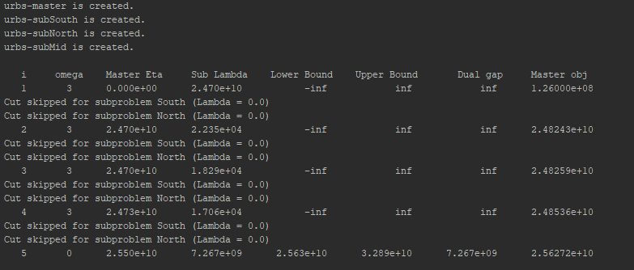
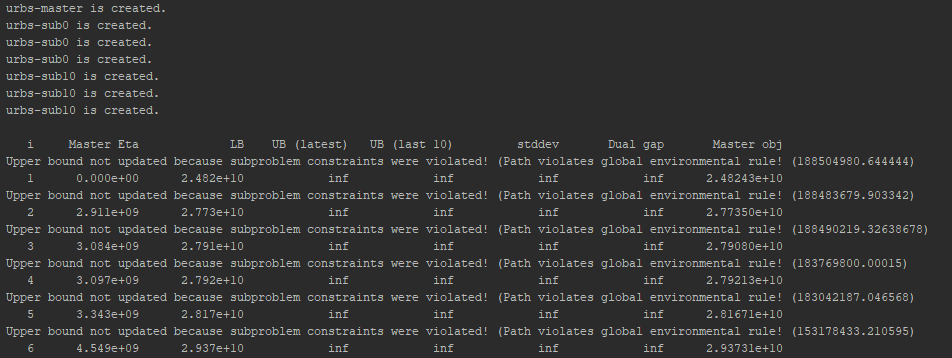

.. _tutorial:

Tutorial
========

This tutorial is a commented walk-through through the script ``runme.py``,
which is a demonstration user script that can serve as a good basis for ones
own script.

In doing this it explains how to apply the decomposition methods and also explains the Benders loop of each decomposition
method in detail.

Imports
-------

::

    import os
    import sys  # save terminal output to file
    import time
    import numpy as np
    import pandas as pd
    import pyomo.environ
    import shutil
    import urbs
    from urbs import urbsType
    from urbs import parallelization as parallel
    from pyomo.opt.base import SolverFactory

We use the same imports as normal urbs described in :ref:`imports original`. PYOMO3 support is not yet included for decomposition.
Also we need some additional imports:

- ``sys`` is a standard python module which we use to redirect the terminal output to a file if desired.

- ``time`` is used to measure the time for hardware tracking.

- ``numpy`` and ``panda`` are python modules which enable fast and convenient handling of data.

- from ``urbs`` we explicitly import ``urbsType`` which is used to create different models depending on the decomposition method used
  and the type of the model (master, sub, sub with input file or normal). ``urbs.parallelization`` makes it possible to solve
  several pyomo models in parallel (see :ref:`parallelization`) using the python module ``Pyro4``.

Input Settings
--------------
We continue with the main function of the script which is the last method in the code.

The script starts with the specification of the input file, which is to be
located in the same folder as script ``runme.py``::

    # Choose input file
    input_file = 'mimo-example.xlsx'

    result_name = os.path.splitext(input_file)[0]  # cut away file extension
    result_dir = urbs.prepare_result_directory(result_name)  # name + time stamp

    # copy input file to result directory
    shutil.copyfile(input_file, os.path.join(result_dir, input_file))
    # copy runme.py to result directory
    shutil.copy(__file__, result_dir)
    # copy current version of scenario functions
    shutil.copy('urbs/scenarios.py', result_dir)

Variable ``input_file`` defines the input spreadsheet, from which the
optimization problem will draw all its set/parameter data. The input file and
the script ``runme.py`` are automatically copied into the result folder.

Next the decomposition method is chosen::

    # Choose decomposition method (divide-timesteps , regional , sddp or None)
    decomposition_method = 'divide-timesteps'
    # Check if valid decomposition method is chosen
    if decomposition_method not in ['divide-timesteps', 'regional', 'sddp', None]:
        raise Exception('Invalid decomposition method. Please choose \'divide-timesteps\' or \'regional\' or \'sddp\' or None')

Next the desired solver is specified::

    # choose solver(cplex, glpk, gurobi, ...)
    solver = 'glpk'

The solver has to be licensed for the specific user, where the open source
solver "glpk" is used as the standard if the solver is not specified.

The model parameters are finalized with a specification of time step length and
modeled time horizon::

    # simulation timesteps
    (offset, length) = (0, 20)  # time step selection
    timesteps = range(offset, offset + length + 1)

Variable ``timesteps`` is the list of time steps to be simulated. Its members
must be a subset of the labels used in ``input_file``'s sheets "Demand" and
"SupIm". It is one of the function arguments to :func:`create_model` and
accessible directly, so that one can quickly reduce the problem size by
reducing the simulation ``length``, i.e. the number of time steps to be
optimised.

:func:`range` is used to create a list of consecutive integers. The argument
``+1`` is needed, because ``range(a,b)`` only includes integers from ``a`` to
``b-1``::

    >>> range(1,11)
    [1, 2, 3, 4, 5, 6, 7, 8, 9, 10]

In the next step parameters only specified for certain decomposition methods can be set.

::

    # settings for sddp and divide-timesteps
    if decomposition_method in ['divide-timesteps', 'sddp']:
        support_steps = [0, 10, 20]

    if decomposition_method == 'regional':
        sub_input_files = {'Bavaria': 'bavaria.xlsx'}

In Divide Timesteps and SDDP we have to set the support steps which determine at which time steps the problem is split into sub problems.
In Divide Timesteps the support steps must include the first and the last time step fpr the method to work correctly.
If you don't include them they are added in automatically.
In SDDP the last time step is also added automatically to the support steps, but you can choose to omit the first time step.
This then means that the input data up to the first support step is considered to be certain and this part is optimized in the
master problem. The uncertainty only starts after the first support step.
In Regional we can optionally pass a sub input file for any site in a dict of the form ``{'site1': 'file1','site2': 'file2'}``.

Scenarios
---------

The ``scenarios`` list in the end of the runme file allows to select the
scenarios to be actually run. How the scenarios are defined and how new ones can be created is explained in :ref:`scenarios`.

::

    scenarios = [
    urbs.scenario_base,
    urbs.scenario_stock_prices,
    urbs.scenario_co2_limit,
    urbs.scenario_co2_tax_mid,
    urbs.scenario_no_dsm,
    urbs.scenario_north_process_caps,
    urbs.scenario_all_together]

Run scenarios
-------------

::

    for scenario in scenarios
        result = run_scenario_decomposition(input_file, timesteps, scenario, result_dir,
                                                solver=solver,
                                                decomposition_method=decomposition_method,
                                                support_steps=support_steps,  # only for divide-timesteps and sddp
                                                sub_input_files={},  # only for regional
                                                plot_tuples=plot_tuples,
                                                plot_periods=plot_periods,
                                                report_tuples=report_tuples,
                                                plot_sites_name=plot_sites_name,
                                                report_sites_name=report_sites_name,
                                                plot_and_report=False,
                                                write_lp_files=False,
                                                write_lp_files_every_x_iterations=None,
                                                numeric_focus=False,
                                                save_terminal_output=False,
                                                readable_cuts=False,  # only for divide-timesteps
                                                save_hardware_usage=False,
                                                print_omega=False,  # only for regional
                                                run_normal=False,
                                                parallel_solving=False,
                                                number_of_workers=None,
                                                save_h5_every_x_iterations=None)

Having prepared settings, input data and scenarios, the actual computations
happen in the function :func:`run_scenario_decomposition`.
It is executed for each of the scenarios included in the
scenario list. The following sections describe the content of function
:func:`run_scenario_decomposition`. In a nutshell, it reads the input data from its argument
``input_file``, modifies it with the supplied ``scenario``, runs the
optimisation for the given ``timesteps`` and writes results and plots to
``result_dir``.

Options of Run Scenario Decomposition
^^^^^^^^^^^^^^^^^^^^^^^^^^^^^^^^^^^^^

This sub section gives a complete list of the options of :func:`run_scenario_decomposition` and how to use them.

::

    solver=solver,

Sets the solver to be used, if None, "glpk" is used.

::

    decomposition_method=decomposition_method,

Determines the decomposition method. If None, no decomposition is done.

::

    support_steps=support_steps,  # only for divide-timesteps and sddp

The support steps determine at which points in the time series the original problem is split into sub problems for Divide Timesteps and SDDP.

::

    sub_input_files={},  #only for regional

In regional it is possible to specify separate input files for sub regions. They are passed in a dict by this option.

::

    plot_tuples=plot_tuples,
    plot_periods=plot_periods,
    report_tuples=report_tuples,
    plot_sites_name=plot_sites_name,
    report_sites_name=report_sites_name,
    plot_and_report=False,

All these options except ``plot_and_report`` are explained in the sections :ref:`plot` and :ref:`report`.
If ``plot_and_report`` is True plotting and reporting is done, if not it is skipped.

::

    write_lp_files=False,
    write_lp_files_every_x_iterations=None,

Debug Feature: If ``write_lp_files`` is True, the .lp files of the models (contain all information about the model) are saved in a subdirectory of the result directory at the end of the benders loop.
If ``write_lp_files_every_x_iterations`` is set to a natural number, additional .lp files are saved every x iterations. If it is None it is ignored.

::

    numeric_focus=False,

If ``numeric_focus`` is True, the solver calculates more carefully. This usually leads to better convergence, but more time
spent on solving. The convergence improves especially if the parameters values differ in several orders of magnitude.
Therefore it is recommended to use ``numeric_focus`` whenever convergence is slow.

::

    save_terminal_output=False,

If True the terminal output is saved to a file inside the result directory.

::

    readable_cuts=False,  # only for divide-timesteps

Debug Feature: If True, the cuts are represented in a way which makes their mathematical interpretation more clear,
but might lead to numerical problems as a multiplication with a number happens which is potentially very close to zero
(see :ref:`cuts divide timesteps`).
Only works for Divide Timesteps.

::

    save_hardware_usage=False,

Debug/Performance Feature: If True the time and computing resources taken up by the program are saved to a file in the result directory after every iteration of the benders loop.

::

    print_omega=False,  # only for regional

If True, in the output of each benders iteration of Regional the sum of the omegas is printed.
This is in so far interesting as when omega is zero (every 5 iterations) the sub problems are forced to not violate any constraints
given by the master problem except the cost constraint. This leads to a faster estimation of an upper bound.

::

    run_normal=False,

Debug Feature: If True the problem is additionally run without decomposition for comparison.

::

    parallel_solving=False,
    number_of_workers=None,

If ``parallel_solving`` is True, subproblems are solved in parallel using `Pyro`_ where it is possible.
In ``number_of_workers`` the number of Pyro solver servers (MIP servers) can be specified.
If it is None the numbers of servers is set to the number of cores by default.

.. warning::
  If you set ``parallel_solving`` to True make sure that no other programs using Pyro are running, because
  this could lead to unexpected behaviour or crashes (see :ref:`parallelization`).

::

    save_h5_every_x_iterations=None

Debug Feature: The solved models are always saved in .h5 files (these contain the models without equations and can be loaded with ``urbs.load()``)
after convergence of the benders loop.
If this option is not None, the models are additionally saved every x iterations.

Complete Walkthrough of Run Scenario Decomposition
^^^^^^^^^^^^^^^^^^^^^^^^^^^^^^^^^^^^^^^^^^^^^^^^^^

::

    # This is done as the first thing to get the pyro servers running, so that another program can detect another pyro program is running
    if parallel_solving:
        # start pyro servers
        servers = parallel.start_pyro_servers(number_of_workers)

If ``parallel_solving`` is True, first the Pyro servers are started up. This is done first, to avoid problems with several Pyro programs running at the same time (see :ref:`parallelization`).

::

    # check for valid decomposition method
    if decomposition_method not in ['divide-timesteps', 'regional', 'sddp', None]:
        raise Exception('Invalid decomposition method. Please choose \'divide-timesteps\' or \'regional\' or \'sddp\' or None')

Check if decomposition method is valid.

::

    # scenario name, read and modify data for scenario
    sce = scenario.__name__
    data = urbs.read_excel(input_file)
    # drop source lines added in Excel
    for key in data:
        data[key].drop('Source', axis=0, inplace=True, errors='ignore')
    data = scenario(data)
    urbs.validate_input(data)

Function :func:`read_excel` returns a dict ``data`` of up to 12 pandas
DataFrames with hard-coded column names that correspond to the parameters of
the optimization problem (like ``eff`` for efficiency or ``inv-cost-c`` for
capacity investment costs). The row labels on the other hand may be freely
chosen (like site names, process identifiers or commodity names). By
convention, it must contain the six keys ``commodity``, ``process``,
``storage``, ``transmission``, ``demand``, and ``supim``. Each value must be a
:class:`pandas.DataFrame`, whose index (row labels) and columns (column labels)
conforms to the specification given by the example dataset in the spreadsheet
:file:`mimo-example.xlsx`.

``data`` is then modified by applying the :func:`scenario` function to it. To
then rule out a list of known errors, that accumulate through growing user
experience, a variety of validation functions specified in script
``validate.py`` in subfolder ``urbs`` is run on the dict ``data``.

::

    # start saving terminal output to file
    if save_terminal_output:
        # save original terminal output to restore later
        write_to_terminal = sys.stdout
        terminal_output_file = open(os.path.join(result_dir, 'terminal-{}.out'.format(sce)), 'w')
        # This class allows to write to the Terminal and to any number of files at the same time
        sys.stdout = urbs.TerminalAndFileWriter(sys.stdout, terminal_output_file)

The class ``TerminalAndFileWriter`` in ``output.py`` redirects the terminal output to both the terminal output and a file.
The old value of ``sys.stdout`` is saved in ``write_to_terminal`` to be restored later.

::

    # refresh time stamp string and create filename for logfile
    log_filename = os.path.join(result_dir, '{}.log').format(sce)

    # setup solver
    optim = setup_solver(solver, numeric_focus, logfile=log_filename)

Set up the solver.

::

    if save_hardware_usage:
        # start_time for hardware tracking
        start_time = time.time()

    # create normal
    if run_normal or decomposition_method is None:
        prob = urbs.Normal(data, timesteps)
    # solve normal
    if run_normal or decomposition_method is None:
        result_prob = optim.solve(prob, tee=False)
        print('Original problem objective: ' + str(prob.obj()))

        # save original problem solution (and input data) to HDF5 file
        if run_normal or decomposition_method is None:
            # save models (and input data) to HDF5 file
            h5_dir = os.path.join(result_dir, 'h5_files')
            if not os.path.exists(h5_dir):
                os.makedirs(h5_dir)
            urbs.save(prob, os.path.join(h5_dir, 'original-{}.h5'.format(sce)))

        if write_lp_files:
            lp_dir = os.path.join(result_dir, 'lp_files')
            if not os.path.exists(lp_dir):
                os.makedirs(lp_dir)
            prob.write(os.path.join(lp_dir, 'original' + '-{}.lp'.format(sce)),
                       io_options={'symbolic_solver_labels': True})

    if save_hardware_usage:
        track_file = os.path.join(result_dir, scenario.__name__ + '-tracking.txt')
        process = urbs.create_tracking_file(track_file,start_time)

If no decomposition method is chosen or ``run_normal`` is True, solve the original problem and save the solution to a .h5 file.

First the original problem is created by the constructor call to :func:`Normal`.
Argument ``tee=True`` enables the realtime console
output for the solver. If you want less verbose output, simply set it to
``False`` or remove it.
If ``write lp_files`` is True, the .lp file is saved.
If ``save_hardware_usage`` is True, the time taken to solve the original problem is measured.

::

    # set up models
    # set up parameters for divide-timesteps
    if decomposition_method == 'divide-timesteps':
        # support time steps
        supportsteps = [i for i in support_steps if i <= max(timesteps)]
        # the support timesteps need to include the max timestep for the method to correctly work.
        if not max(timesteps) in supportsteps:
            supportsteps.append(max(timesteps))
        # the support timesteps need to include the min timestep for the method to correctly work.
        if not min(timesteps) in supportsteps:
            supportsteps.insert(0,min(timesteps))

        # create models
        master = urbs.DivideTimestepsMaster(data, supportsteps)

        sub = {}
        for inst in range(0, len(supportsteps) - 1):
            sub[supportsteps[inst]+1] = urbs.DivideTimestepsSub(data, range(supportsteps[inst], supportsteps[inst + 1] + 1),
                supportsteps)

        # output template
        urbs.create_benders_output_table(print_omega=print_omega)

Set up the models and variables specific to the decomposition method Divide Timesteps:
First make sure max and min time steps are included in support steps (this is necessary for the method to work correctly).
Then create master and sub instances and set up the output table.

::

    # set up parameters for regional
    elif decomposition_method == 'regional':
        # if 'test_timesteps' is stored in data dict, replace the timesteps parameter with that value
        timesteps = data.pop('test_timesteps', timesteps)

        # subproblem data
        sub_data = {}
        for item in sub_input_files:
            sub_data[item] = urbs.read_excel(sub_input_files[item])
            # drop source lines added in Excel
            for key in sub_data[item]:
                sub_data[item][key].drop('Source', axis=0, inplace=True, errors='ignore')
            sub_data[item] = scenario(sub_data[item])
            # if 'test_timesteps' is stored in data dict, replace the timesteps parameter with that value
            timesteps = sub_data[item].pop('test_timesteps', timesteps)

        # create models
        master = urbs.RegionalMaster(data, timesteps)
        master_sites = urbs.get_entity(master, 'sit')
        master_sites = master_sites.index.values.tolist()

        sub = {}
        for sit in master_sites:
            if sit in sub_input_files:
                sub[sit] = urbs.RegionalSub(sub_data[sit], timesteps, model_type=urbsType.subwfile,
                                             site=sit, msites=master_sites)
            else:
                sub[sit] = urbs.RegionalSub(data, timesteps, model_type=urbsType.sub,
                                             site=sit, msites=master_sites)

        # output template
        urbs.create_benders_output_table(print_omega=print_omega)

Similar the models for regional are set up. If separate input files are specified for sub problems they are read into working memory.
If only a certain amount of time steps is used for testing, this can be included in the scenario as ``test_timesteps``.

::

    # set up parameters for sddp
    elif decomposition_method == 'sddp':
        # support time steps
        supportsteps = [i for i in support_steps if i <= max(timesteps)]
        # the support timesteps need to include the max timestep for the method to correctly work.
        if not max(timesteps) in supportsteps:
            supportsteps.append(max(timesteps))

        # uncertainty factors
        wind_scenarios = {'low': 0, 'mid': 0, 'high': 0}
        realizations = [key for key in wind_scenarios]
        probabilities = {'low': 0.2, 'mid': 0.5, 'high': 0.3}

         # create models
        master = urbs.SddpMaster(data,  range(timesteps[0], supportsteps[0] + 1), supportsteps, first_timestep=timesteps[0])

        sub = {}
        for inst in range(0, len(supportsteps) - 1):
            for wind_sce in wind_scenarios:
                sub[(supportsteps[inst], wind_sce)] = urbs.SddpSub(data, range(supportsteps[inst], supportsteps[inst + 1] + 1),
                    supportsteps, uncertainty_factor=wind_scenarios[wind_sce], first_timestep=timesteps[0])

        avg = np.inf
        stddev = np.inf
        upper_bounds = []

        #output template
        urbs.create_benders_output_table_sddp()

Set up parameters for SDDP. The support steps need to include the last time step for the method to work correctly,
but not the first, because the master is allowed to do some of the resource planning. This makes sense, because the
time series in the near future can still be considered to be certain, with the uncertainty starting only after some amount of time.
``wind_scenarios`` are different scenarios on wind speed. ``probabilities`` give the probability with which a scenario is happening.
``avg``, ``stddev`` are the average and standard deviation of the last ten upper bounds and are used later for the convergence criterion of SDDP.
``upper_bounds`` is just a list of the calculated upper bounds.

::

    if decomposition_method is not None:
        # set up benders loop parameters
        lower_bound = -np.inf
        upper_bound = np.inf
        gap = np.inf
        maxit = 1000
        tol = 1e-6

        # save information for every iteration to plot in the end
        iterations = []
        plot_lower_bounds = []
        plot_upper_bounds = []
        normal = []

Set up parameters common to all decomposition methods. These are the initial lower and upper bound and the gap between them,
the maximum number of iterations, the tolerance which determines when the Benders loop converges
as well as lists of the lower bounds, upper bounds, original objective and iterations for the convergence plot.

::

    # call benders loop if a decomposition method is selected
    if decomposition_method is not None:
        for i in range(1, maxit):
            # master problem solution
            result_master = optim.solve(master, tee=False)

Start of the benders loop (only if decomposition is not None). The loop runs until convergence or until ``maxit`` is reached.
First thing in the loop the current master problem is solved.

::

    if decomposition_method == 'divide-timesteps':
        master, sub, lower_bound, upper_bound, gap = benders_loop_divide_timesteps(master, sub, lower_bound, upper_bound, gap, optim, readable_cuts, parallel_solving=parallel_solving)
        # output information about the iteration
        urbs.update_benders_output_table(i, master, sum(master.eta[t]() for t in master.tm), sub, lower_bound, upper_bound, gap,   print_omega=print_omega)

    elif decomposition_method == 'regional':
        master, sub, lower_bound, upper_bound, gap = benders_loop_regional(master, sub, sub_input_files,
                                                                   lower_bound, upper_bound, gap, optim, i,parallel_solving=parallel_solving)

        # output information about the iteration
        urbs.update_benders_output_table(i, master, sum(master.eta[sit]() for sit in master.sit), sub, lower_bound, upper_bound, gap,
                             print_omega=print_omega)

    elif decomposition_method == 'sddp':
        master, sub, lower_bound, upper_bound, gap, avg, stddev,  upper_bounds = benders_loop_sddp(master, sub, lower_bound, upper_bound, gap,avg,stddev,upper_bounds,supportsteps,
                                                            realizations, probabilities, optim, data, first_timestep=timesteps[0], parallel_solving=parallel_solving)

        # output information about the iteration
        urbs.update_benders_output_table_sddp(i, master, lower_bound, upper_bound, avg, stddev, gap, master.obj())

The actual loop is different for each decomposition method. The respective functions are explained further down in detail.
After the function call, information about the current iteration is printed using the functions :func:`update_benders_output_table(_sddp)`.

::

    if save_hardware_usage:
        # save memory usage
        urbs.update_tracking_file(track_file,i,start_time, process)

    # save information for convergence plot
    iterations.append(i)
    plot_lower_bounds.append(master.obj())
    plot_upper_bounds.append(upper_bound)
    if run_normal:
        normal.append(prob.obj())

If ``save_hardware_usage`` is True, information about performance of the iteration is saved to the tracking file.
The list for the plots are extended by the iteration, the current lower bound, the current upper bound and the original objective (if ``run_normal`` is True) respectively.

::

    if gap < tol * lower_bound:
        #create an excel file which summarizes the results of the benders loop
        if run_normal:
            difference = prob.obj() - master.obj()
            print('\n', 'Difference =', prob.obj() - master.obj())
        else:
            difference = 'Not calculated'
        df = pd.DataFrame([[scenario.__name__, difference, gap, i]],
                          columns=['Scenario', 'Difference', 'gap', 'Iterations'],
                          index=[0])
        urbs.append_df_to_excel(os.path.join(result_dir, 'scenario_comparison.xlsx'), df)
        break

The benders loop converges if the gap is smaller than the tolerance times the lower bound.
After convergence the difference to the original is calculated if the original was solved.
An excel sheet ``scenario_comparison.xlsx`` is created which contains concise information about the benders convergence for all calculated scenarios.

::

    if i % 50 == 0:
        if decomposition_method in ['regional','divide-timesteps']:
            urbs.create_benders_output_table(print_omega=print_omega)
        elif decomposition_method == 'sddp':
            urbs.create_benders_output_table_sddp()

For better comprehension of the output table the headline of the output table is repeated every 50 iterations.

::

    if save_h5_every_x_iterations is not None and i%save_h5_every_x_iterations == 0:
        # save models (and input data) to HDF5 file
        h5_dir=os.path.join(result_dir,'h5_files')
        if not os.path.exists(h5_dir):
            os.makedirs(h5_dir)
        urbs.save(master, os.path.join(h5_dir, 'master' + '-iteration-{}'.format(i) + '-{}.h5'.format(sce)))

        # save subproblems to .h5 files
        for inst in sub:
            urbs.save(sub[inst], os.path.join(h5_dir, 'sub' + str(inst) + '-iteration-{}'.format(i) + '-{}.h5'.format(sce)))

    if write_lp_files and write_lp_files_every_x_iterations is not None and i%write_lp_files_every_x_iterations==0:
        # save models to lp files
        lp_dir = os.path.join(result_dir, 'lp_files')
        if not os.path.exists(lp_dir):
            os.makedirs(lp_dir)
        master.write(os.path.join(lp_dir, 'master' + '-iteration-{}'.format(i) + '-{}.lp'.format(sce)),
                     io_options={'symbolic_solver_labels': True})
        for inst in sub:
            sub[inst].write(os.path.join(lp_dir, 'sub' + str(inst) + '-iteration-{}'.format(i) + '-{}.lp'.format(sce)),
                            io_options={'symbolic_solver_labels': True})

If the options to save to .h5 or .lp every x iterations are set they are saved in this part of the code.
End of benders loop.

::

    if parallel_solving:
        # Shut down pyro servers
        parallel.shutdown_pyro_servers(servers)

    # close terminal to file stream
    if save_terminal_output:
        sys.stdout = write_to_terminal

    if plot_and_report:
        # write report to spreadsheet
        urbs.report(
            prob,
            os.path.join(result_dir, '{}.xlsx').format(sce),
            report_tuples=report_tuples, report_sites_name=report_sites_name)

        # result plots
        urbs.result_figures(
            prob,
            os.path.join(result_dir, '{}'.format(sce)),
            timesteps,
            plot_title_prefix=sce.replace('_', ' '),
            plot_tuples=plot_tuples,
            plot_sites_name=plot_sites_name,
            periods=plot_periods,
            figure_size=(24, 9))

After the benders loop the Pyro servers are shutdown again (in case of ``parallel_solving``) and
the terminal output stream is restored (in case of ``save_terminal_output``).
If ``plot_and_report`` is True, :ref:`plot` and :ref:`report` is done.

.. warning::
  Plotting and Reporting is so far only supported for the original problem (no decompositon method).
  If the option ``plot_and_report`` is True, the decomposition method is not None, and ``run_normal`` is True,
  Plotting and Reporting will be done for the normal (not decomposed) problem.
  If ``plot_and_report`` is True, the decomposition method is not None, and ``run_normal`` is False,
  the program will crash!

::

    if decomposition_method is None:
        return prob
    else:
        # show plot
        urbs.plot_convergence(iterations, plot_lower_bounds, plot_upper_bounds, result_dir, sce, run_normal=run_normal, normal=normal)

        # save lp files
        if write_lp_files:
            # save models to lp files
            lp_dir = os.path.join(result_dir, 'lp_files')
            if not os.path.exists(lp_dir):
                os.makedirs(lp_dir)
            master.write(os.path.join(lp_dir, 'master' + '-{}.lp'.format(sce)),
                         io_options={'symbolic_solver_labels': True})
            for inst in sub:
                sub[inst].write(
                    os.path.join(lp_dir, 'sub' + str(inst) + '-{}.lp'.format(sce)),
                    io_options={'symbolic_solver_labels': True})

        # save models (and input data) to HDF5 file
        h5_dir = os.path.join(result_dir, 'h5_files')
        if not os.path.exists(h5_dir):
            os.makedirs(h5_dir)
        urbs.save(master, os.path.join(h5_dir, 'master' +  '-{}.h5'.format(sce)))

        # save subproblems to .h5 files
        for inst in sub:
            urbs.save(sub[inst],
                      os.path.join(h5_dir, 'sub' + str(inst) +  '-{}.h5'.format(sce)))

        return sub, master

If no decomposition method is used the solved instance of the normal model is returned.
Otherwise the convergence of the benders loop is shown in a plot and the models solutions are saved in .h5 files and .lp files (only if ``write_lp_files`` is True).
Finally the (solved) sub instances and the master instance are returned.

Walkthrough of Benders Loop Divide Timesteps
^^^^^^^^^^^^^^^^^^^^^^^^^^^^^^^^^^^^^^^^^^^^

::

    def benders_loop_divide_timesteps(master, sub, upper_bound, gap, optim,  readable_cuts, parallel_solving=False):
        """
        Calculates one iteration of the benders loop for divide timesteps

        Args:
            master: instance of the master problem
            sub: sub problem instances
            upper_bound: current upper bound of benders decomposition
            gap: gap between upper and lower bound
            optim: solver for the problem
            readable_cuts: scale cuts to make them easier to read (may cause numerical issues)

        Returns:
            updated values for master, sub, lower_bound, upper_bound, gap
        """

        for inst in sub:
            # restrictions of sub problem
            sub[inst].set_boundaries(master, 'cap_pro', 'pro_inst')
            sub[inst].set_boundaries(master, 'cap_tra', 'tra_inst')
            sub[inst].set_boundaries(master, 'cap_sto_c', 'sto_c_inst')
            sub[inst].set_boundaries(master, 'cap_sto_p', 'sto_p_inst')
            sub[inst].set_boundaries(master, 'e_sto_con', 'e_sto_state')

            sub[inst].eta_res[sub[inst].tm[-1]].expr = master.eta[sub[inst].tm[-1]]()

            for com in master.com_tuples:
                sub[inst].e_co_stock_res[com].expr = master.e_co_stock[sub[inst].tm[-1], com]()

First the boundaries of the sub problems are set such that they need to fulfill constraints given by the master problem.
Specifically the capacity variables of the sub problem (ending on inst) are set to the capacity given by the master problem,
the storage state of the first and last time step of the sub problem are set to the storage content in the corresponding time steps in the master problem,
the costs of the sub problem are limited with ``eta_res``
and the usage of stock commodities is limited by ``e_co_stock_res``.

::

    if parallel_solving:
        # subproblem solution
        result_sub = parallel.solve_parallel(sub, optim)
    else:
        result_sub={}
        for inst in sub:
            # subproblem solution
            result_sub[inst] = optim.solve(sub[inst], tee=False)

Next the sub problems are solved. If ``parallel_solving`` is set,
they are passed by the function ``solve_parallel`` to the running pyro workers (see :ref:`parallelization`).
Else they are solved sequentially.

::

    # serial cut generation
    for inst in sub:
        # cut generation
        master.add_cut(sub[inst], readable_cuts)

The cuts are generated and added for each sub problem by a function in the master instance. See :ref:`cuts divide timesteps`.

::

    lower_bound = master.obj()

The optimal solution has to cost at least as much as the current objective of the master problem for the following reasons:

- The master problem objective consists of the costs of a part of the variables (the capacities) which it can optimize and a cost term given by the sub problems
  which is treated as constant.

- The cost term the master problem can optimize can only get higher in later iterations, because more constraints can be added to the master problem,
  but no constraints can be removed.

- The costs given by the sub problems can only get higher, because the bounds the sub problems receive from the master problem can only get tighter
  as the master problem acquires more cuts.

::

    try:
        # Check feasibility of subproblems with respect to constraints for which additional cost cannot be computed
        for inst in sub:
            for ct in sub[inst].com_tuples:
                if sub[inst].commodity.loc[ct, 'max'] < np.inf:
                    if sum(sub[inst].e_co_stock[(tm,) + ct]() for tm in sub[inst].tm) - sub[inst].e_co_stock_res[ct]() > 0.001:
                        raise ValueError("Subproblem violates stock commodity constraints!")

            for sit, sto, com in sub[inst].sto_tuples:
                for t in sub[inst].tm:
                    if t == sub[inst].ts[1]:
                        if (sub[inst].e_sto_con[t, sit, sto, com]() -
                                sub[inst].e_sto_state[t, sit, sto, com]() > 0.001):
                            raise ValueError("Subproblem violates storage content constraints!")
                    if t == sub[inst].ts[2]:
                        if (sub[inst].e_sto_con[t, sit, sto, com]() -
                                sub[inst].e_sto_state[t, sit, sto, com]() < -0.001):
                            raise ValueError("Subproblem violates storage content constraints!")

            if sub[inst].dt * sub[inst].weight * sum(- urbs.modelhelper.commodity_balance(sub[inst], tm, sit, 'CO2')()
                                           for tm in sub[inst].tm
                                           for sit in sub[inst].sit) \
                    - sum(sub[inst].e_co_stock_res[sit, 'CO2', 'Env']() for sit in sub[inst].sit) > 0.001:
                raise ValueError("Subproblem violates CO2 constraints!")

Try if any of the sub problems violates any of the following constraints:

- Stock commodity constraints: Violated if the sub problems uses more of a commodity than it is given by the master problem.

- Storage content constraints: Violated if any of the sub problems storages is greater than the storage assigned to it by the master problem
  in the first time step or lower than the storage it needs to have left in the last time step.

- CO2 constraints: Violated if the maximum allowed threshold for CO2 is passed.

If one of the constraints is violated, the sub problem is infeasible.
In this case we cannot compute an upper bound in this iteration.

::

        # determining the costs of units' production between iterations
        cost_pro = urbs.get_production_cost(master, sub, 'cap_pro', 'pro')
        cost_sto_c = urbs.get_production_cost(master, sub, 'cap_sto_c', 'sto_c')
        cost_sto_p = urbs.get_production_cost(master, sub, 'cap_sto_p', 'sto_p')

        cost_tra = 0.0

        for sin, sout, type, com in master.tra_tuples:
            max_tra = max(max(sub[inst].e_tra_in[(tm, sin, sout, type, com)]()
                              for inst in sub
                              for tm in sub[inst].tm),
                          max(sub[inst].e_tra_in[(tm, sout, sin, type, com)]()
                              for inst in sub
                              for tm in sub[inst].tm))
            tra = (sin, sout, type, com)
            if max_tra > master.cap_tra[tra]():
                cost_tra += ((max_tra - master.cap_tra[tra]()) *
                             master.transmission.loc[tra]['inv-cost'] *
                             master.transmission.loc[tra]['annuity-factor'])

        costs = cost_pro + cost_tra + cost_sto_c + cost_sto_p

Check if for any process, storage, or transmission variable in the sub problems the capacity is higher than the capacity installed in the master problem.
If this happens the master problem needs to install the maximum capacity needed for that variable in any sub problem
(This is done by the function :func:`get_production_cost`. See :ref:`benders`).
The cost of this installation is accumulated in costs.

::

        # convergence check
        gap, lower_bound, upper_bound = urbs.convergence_check(master, sub, upper_bound, costs, 'divide-timesteps')

Calculate the new upper bound and gap (see :ref:`benders`).

::

    except ValueError as err:
        print("Upper bound not updated because subproblem constraints were violated! (" + str(err) + ")")
    return master, sub, lower_bound, upper_bound, gap

Except the ValueError if no upper bound was calculated and return the updated models and values.

Walkthrough of Benders Loop Regional
^^^^^^^^^^^^^^^^^^^^^^^^^^^^^^^^^^^^

::

    def benders_loop_regional(master, sub, sub_input_files, lower_bound, upper_bound, gap, optim, i, parallel_solving=False):
        """
        Calculates one iteration of the benders loop for regional

        Args:
            master: instance of the master problem
            sub: sub problem instances
            sub_input_files: list of filenames to Excel spread sheets for sub regions, can be set for regional method
            lower_bound: current lower bound of benders decomposition
            upper_bound: current upper bound of benders decomposition
            gap: gap between upper and lower bound
            optim: solver for the problem
            i: number of the current iteration
            parallel_solving: If true sub instances are solved in parallel with pyro

        Returns:
            updated values for master, sub, lower_bound, upper_bound, gap, track_file
        """
        if i % 5 == 0:
            for inst in sub:
                getattr(sub[inst], 'omega').set_value(0)
        else:
            for inst in sub:
                getattr(sub[inst], 'omega').set_value(1)

Every five iterations omega is set to zero.
As a consequence the sub problems are forced to not violate any constraints given by the master problem except the
cost constraint. This leads to a faster estimation of an upper bound, because the sub problem becomes feasible as no constraints can be violated.

::

    # subproblem restrictions
    for inst in sub:
        # subproblem with input file
        if inst in sub_input_files:
            # e_co_stock
            for tm in master.tm:
                sub[inst].e_co_stock_res[tm] = master.e_co_stock[tm, sub[inst].sub_site[1], 'CO2', 'Env']()
            # cap_tra
            for tra in master.tra_tuples:
                if tra[0] == sub[inst].sub_site[1]:
                    sub[inst].hvac[tra[1]] = master.cap_tra[tra]()
                else:
                    continue
            # e_tra
            for tm in master.tm:
                for tra in master.tra_tuples:
                    if tra[0] == sub[inst].sub_site[1]:
                        sub[inst].e_export_res[tm, tra[1]] = master.e_tra_out[tm, tra]()
                    elif tra[1] == sub[inst].sub_site[1]:
                        sub[inst].e_import_res[tm, tra[0]] = master.e_tra_in[tm, tra]()
                    else:
                        continue
            # eta
            sub[inst].eta_res[sub[inst].sub_site[1]] = master.eta[sub[inst].sub_site[1]]()
        else:
            sub[inst].set_boundaries(master, 'e_co_stock', 'e_co_stock_res')
            sub[inst].set_boundaries(master, 'e_tra_out', 'e_tra_out_res')
            sub[inst].set_boundaries(master, 'e_tra_in', 'e_tra_in_res')
            sub[inst].set_boundaries(master, 'eta', 'eta_res')

Set the boundaries of the sub problems to fulfill constraints given by the master problem.
For both sub problems with and without input files we set the restrictions on the cost ``eta_res`` to the
cost given by the master problem and the stock commodity restriction ``e_co_stock_res`` (only relevant for CO2).
In case of sub with input file we need to set everything using ``sub_site[1]`` which just represents the name of the site
in the master problem.

For a sub problem without input file only we set the restriction on the in- and outgoing transmissions ``e_tra_in_res`` and ``e_tra_out_res``.

For a sub problem with input file we need to explicitly set the boundaries on transmission capacity (``hvac``), import
and export. For ``hvac`` and export we take all transmissions tuples that originate in the sub problem (``tra[0] == sub[inst].sub_site[1]``)
and set ``hvac`` to the capacity and ``e_export_res`` to the outgoing transmission. For ``e_import_res`` we do the
same as for export, but checking for incoming transmissions (``tra[1] == sub[inst].sub_site[1]``).

::

    # sub problem solution
    if parallel_solving:
        result_sub = parallel.solve_parallel(sub, optim)
    else:
        result_sub={}
        for inst in sub:
            result_sub[inst] = optim.solve(sub[inst], tee=False)

Next the sub problems are solved. If ``parallel_solving`` is set,
they are passed by the function :func:`solve_parallel` to the running Pyro workers (see :ref:`parallelization`).
Else they are solved sequentially.

::

    # serial cut generation
    for inst in sub:
        # cut generation
        if inst in sub_input_files:
            master.add_cut(sub[inst],sub_in_input_files=True)
        else:
            master.add_cut(sub[inst], sub_in_input_files=False)

The cuts are generated and added to the master for each sub problem by a function in the master instance (see :ref:`regional cut generation`).

::

    # convergence check
    if i % 5 == 0:
        gap, lower_bound, upper_bound = urbs.convergence_check(master, sub, upper_bound, 0, 'regional')

    return master, sub, lower_bound, upper_bound, gap

Update lower and upper bound and return (see :ref:`benders`).

Walkthrough of Benders Loop SDDP
^^^^^^^^^^^^^^^^^^^^^^^^^^^^^^^^

::

    def benders_loop_sddp(master, sub, lower_bound, upper_bound, gap, avg, stddev,upper_bounds, supportsteps, realizations, probabilities,
                      optim, data, first_timestep=0, parallel_solving=False):
        """
        Calculates one iteration of the benders loop for regional

        Args:
            master: instance of the master problem
            sub: sub problem instances
            lower_bound: current lower bound of the benders decomposition
            upper_bound: current upper bound of the benders decomposition
            gap: gap between lower and upper bound
            avg: average of the last 10 upper bounds
            stddev: standard deviation within the last 10 upper bounds
            upper_bounds: list of upper bounds
            supportsteps: a list of timesteps for the master problem, can be set for divide-timesteps method
            realizations: dict of possible realizations of sub problems (e.g. 'high', 'mid', 'low')
            probabilities: probabilities of the realizations
            optim: solver for the problem
            data: The data given by the input file.
            parallel_solving: If true, the possible realizations in the backward iteration are solved in parallel
            first_timestep: The timestep at which the non decomposed problem starts. This is needed to calculate the weight parameter correctly. The default is set to 0.

        Returns:
            updated values for master, sub, lower_bound, upper_bound, gap
        """

        # dict for realized instances of sub
        realize={}
        # Forward recursion
        for inst in range(0, len(supportsteps) - 1):
            realize[inst] = np.random.choice(realizations, p=[value for value in probabilities.values()])

            # save current problem
            cur_prob = sub[(supportsteps[inst], realize[inst])]

            # if previous problem is the master problem
            if inst == 0:
                # set previous problem
                prev_prob = master
            else:
                prev_prob = sub[(supportsteps[inst - 1], realize[inst - 1])]

In the forward recursion we pick a realization of each sub problem at random and set the previous problem to the realized instance
of the previous sub problem or to the master problem in case of the first subproblem.

::

           # exchange variables between time steps
            cur_prob.set_boundaries(prev_prob, 'cap_pro', 'pro_inst')
            cur_prob.set_boundaries(prev_prob, 'cap_tra',  'tra_inst')
            cur_prob.set_boundaries(prev_prob, 'cap_sto_c',  'sto_c_inst')
            cur_prob.set_boundaries(prev_prob, 'cap_sto_p',  'sto_p_inst')
            cur_prob.set_boundaries(prev_prob, 'e_sto_con',  'e_sto_con_res')
            cur_prob.set_boundaries(prev_prob, 'e_co_stock_state',  'e_co_stock_state_res')

            if inst > 0:
                cur_prob.eta_res.expr = prev_prob.eta()

            # solve problem
            optim.solve(cur_prob, tee=False)

Set the constraints on the capacities, the storage content and the stock reserves to the values passed by the previous problem.
Also set the constraint on the costs (``eta_res``) to the value given by the previous sub problem.
In case of the first sub problem we do not need to set this constraint,
because the master problem contains only the zero-th time step and thus does not contribute any cost restriction.

Then the sub problem is solved. End of the forward recursion.

::

    # update upper bound
    try:
        # Check feasibility of subproblems with respect to constraints for which additional cost cannot be computed
        max_value = {}
        violation = {}
        violation_factor = 0.0001

        for sub_inst in [sub[(supportsteps[inst], realize[inst])] for inst in range(0, len(supportsteps) - 1)]:
            for (sit, com, com_type) in sub_inst.com_max_tuples:
                try:
                    max_value[(sit, com, com_type)] += sub_inst.e_co_stock_state[
                                                           sub_inst.t[-1], sit, com, com_type]() \
                                                       - sub_inst.e_co_stock_state[
                                                           sub_inst.t[1], sit, com, com_type]()
                except KeyError:
                    max_value[(sit, com, com_type)] = sub_inst.e_co_stock_state[
                                                           sub_inst.t[-1], sit, com, com_type]() \
                                                       - sub_inst.e_co_stock_state[
                                                           sub_inst.t[1], sit, com, com_type]()

Calculate the maximum used value of all commodities in all sites.
The value is simply calculated by taking the sum of what each sub problem uses of the commodity in the site.
How much the sub problem needs is calculated by taking the commodity stock at the last time step minus the commodity stock in the first time step.

::

        weight = master.weight()
        max_output_ratio_elec_co2 = (master.r_out.xs('Elec', level=1) / master.r_out.xs('CO2', level=1).loc[master.r_out.xs('CO2', level=1) != 0]).replace(np.inf,np.nan).max()
        costs_co2_violation = 0
        violation_bound = violation_factor * data['commodity'].loc[sit, com, com_type]['max']
        for (sit, com, com_type) in max_value.keys():
            violation[(sit, com, com_type)] = max_value[(sit, com, com_type)] * weight - \
                                              data['commodity'].loc[sit, com, com_type]['max']

            if violation[(sit, com, com_type)] > violation_bound:
                raise ValueError(f"Path violates maximum commodity constraint! ({violation[(sit, com, com_type)]})")
            elif violation[(sit, com, com_type)] > violation_bound*0.01:
                # determining violation costs for commodity violation in case of co2
                if com == 'CO2':
                    co2_costs = max_output_ratio_elec_co2 * violation[(sit, com, com_type)] * \
                                master.commodity.loc[sit, 'Slack', 'Stock']['price'] * weight
                    costs_co2_violation += co2_costs
                else:
                    raise ValueError(f"Path violates maximum commodity constraint!"
                                     f"({violation[(sit, com, com_type)]})")

        violation_bound = violation_factor * data['global_prop'].loc['CO2 limit', 'value']
        if sum(max_value[(sit, com, com_type)] for (sit, com, com_type) in max_value.keys() if
               com_type == 'Env') * weight - data['global_prop'].loc['CO2 limit', 'value'] > violation_bound:
            raise ValueError(f"Path violates global environmental rule!"
                             f" ({sum(max_value[(sit, com, 'Env')] for (sit, com, com_type) in max_value.keys()) * weight}")

Try if any of the sub problems violates any of the following constraints.

- Constraint 1: Check if the maximum used value of any commodity is more than 0.01 times the violation bound greater than the maximum allowed amount of that commodity.
  For all commodities except CO2 this triggers an exception. In case of CO2 the exception is only triggered if the violation is more than the violation bound.
  If it is between the violation bound and 0.01 times the violation bound we compute a violation cost which is taken to be as high as the cost of producing Slack "energy".
  The idea of this is to get a faster estimate of an upper bound, because the CO2 constraint is often violated. To estimate
  a cost for the CO2 violation we replace a power plant that produces the most electricity per CO2 (``max_output_ratio_elec_co2``)
  and replace it with an expensive Slack power plant that doesn't produce CO2.

- Constraint 2: Check if the sum of environmental commodities exceeds the allowed CO2 limit by more than the violation bound.

::

        # determining violation costs for storage content
        costs_sto_violation = 0

        for sub_inst in [sub[(supportsteps[inst], realize[inst])] for inst in range(0, len(supportsteps) - 1)]:
            for sit, sto, com in sub_inst.sto_tuples:
                for t in sub_inst.ts:
                    if t == sub_inst.ts[1]:
                        if (sub_inst.e_sto_con[t, sit, sto, com]() -
                                sub_inst.e_sto_con_res[t, sit, sto, com]() > 1):
                            raise ValueError(f"Subproblem violates storage content constraints!"
                                             f"{sub_inst.e_sto_con[t, sit, sto, com]() - sub_inst.e_sto_con_res[t, sit, sto, com]()}")
                        elif (sub_inst.e_sto_con[t, sit, sto, com]() -
                              sub_inst.e_sto_con_res[t, sit, sto, com]() > 0.01):
                            costs_sto_violation += (sub_inst.e_sto_con[t, sit, sto, com]() - sub_inst.e_sto_con_res[t, sit, sto, com]()) \
                                                   * sub_inst.commodity.loc[sit, 'Slack', 'Stock']['price'] * weight

        sub_inst = sub[(supportsteps[-2], realize[len(supportsteps) - 2])]
        t_end = sub_inst.t[-1]
        t_start = master.t[1]
        start_end_difference = master.e_sto_con[t_start, sit, sto, com]() - sub_inst.e_sto_con[t_end, sit, sto, com]()
        violation_bound = violation_factor * master.e_sto_con[t_start, sit, sto, com]()
        for sit, sto, com in sub_inst.sto_tuples:
            if start_end_difference > violation_bound:
                raise ValueError(
                    f"Subproblem violates storage content start end constraints!"
                    f"{start_end_difference}")
            elif (start_end_difference > violation_bound*0.1):
                costs_sto_violation += start_end_difference \
                                       * sub_inst.commodity.loc[sit, 'Slack', 'Stock']['price'] * weight

Next we calculate the costs for storage violations:
First we check for every sub problem whether it fulfills its storage usage constraint. In case it exceeds its limitation by more than
one we throw an error. In case it exceeds it by more than 0.01 we assume the cost of producing the energy deficit as Slack energy.
Next we have to check whether the storage content in the first time step is bigger than the storage content in the last
time step ("storage content start end constraints"). As we require our problem to leave as much energy in the storage as it started with this throws an error.

::

        # determining the costs of units' production between iterations
        worst_case_realization = 'low'

        additional_costs = {}
        cost_types = ['pro', 'sto_c', 'sto_p']

        for ctype in cost_types:
            additional_costs[ctype] = max(urbs.get_production_cost(master,
                                                {(supportsteps[inst], worst_case_realization): sub[
                                                    (supportsteps[inst], worst_case_realization)] for inst in
                                                 range(0, len(supportsteps) - 1)},
                                                f'cap_{ctype}', ctype),
                       urbs.get_production_cost(master,
                                                {(supportsteps[inst], realize[inst]): sub[
                                                    (supportsteps[inst], realize[inst])] for inst in
                                                 range(0, len(supportsteps) - 1)},
                                                f'cap_{ctype}', ctype)
                       )

        cost_tra = 0.0

        for sin, sout, type, com in master.tra_tuples:
            max_tra = max(max(sub_inst.e_tra_in[(tm, sin, sout, type, com)]()
                              for sub_inst in
                              [sub[(supportsteps[inst], realize[inst])] for inst in range(0, len(supportsteps) - 1)]
                              for tm in sub_inst.tm),
                          max(sub_inst.e_tra_in[(tm, sout, sin, type, com)]()
                              for sub_inst in
                              [sub[(supportsteps[inst], realize[inst])] for inst in range(0, len(supportsteps) - 1)]
                              for tm in sub_inst.tm))
            tra = (sin, sout, type, com)
            if max_tra > master.cap_tra[tra]():
                cost_tra += ((max_tra - master.cap_tra[tra]()) *
                             master.transmission.loc[tra]['inv-cost'] *
                             master.transmission.loc[tra]['annuity-factor'])

        # sum up all additional costs
        costs = cost_tra + costs_sto_violation + costs_co2_violation + sum(additional_costs.values())

We also need to check whether the sub problems use more of any capacity than the master problem has installed. If so we need
to add the cost of installing the needed capacities. This cost can be calculated for the process and storage variables using the
function :func:`get_production_cost` (see :ref:`benders`). The transmission cost is calculated slightly different.
We then add up all costs.

::

        upper_bound = (master.obj() - master.eta() + costs
                       + sum(sub[(supportsteps[inst], realize[inst])].costs[cost_type]()
                       for cost_type in ["Variable", "Fuel", "Environmental"]
                       for inst in range(0, len(supportsteps) - 1)))

        upper_bounds.append(upper_bound)

We update the current upper bound by summing up the master cost (``master.obj()``) minus the old costs of the subproblems (``master.eta()``)
plus the additional investment costs accumulated in costs plus the new costs of the sub problems.
The new upper bound is appended to the list of upper bounds.

::

        if len(upper_bounds) > 10:
            bounds = upper_bounds[-10:]
            avg = np.mean(bounds)
            stddev = np.std(bounds)
            gap = avg + 1 * stddev - lower_bound

If more than ten upper bounds have been calculated, we take the average and the standard deviation of the last ten and use this to calculate the new gap
by taking the average plus the standard deviation minus the lower bound (see overview of :ref:`overview sddp`).

::

    except ValueError as err:
        print("Upper bound not updated because subproblem constraints were violated! (" + str(err) + ")")

If no upper bound was calculated print which constraint was violated.

::

    # Backward recursion
    for inst in range(len(supportsteps) - 2, -1, -1):
        # if previous problem is the master problem
        if inst == 0:
            # set previous problem
            prev_prob = master
        else:
            prev_prob = sub[(supportsteps[inst - 1], realize[inst - 1])]

        cur_probs = {}
        for cur_real in realizations:
            cur_prob = sub[(supportsteps[inst], cur_real)]

            # exchange variables between time steps
            cur_prob.set_boundaries(prev_prob, 'cap_pro', 'pro_inst')
            cur_prob.set_boundaries(prev_prob, 'cap_tra', 'tra_inst')
            cur_prob.set_boundaries(prev_prob, 'cap_sto_c', 'sto_c_inst')
            cur_prob.set_boundaries(prev_prob, 'cap_sto_p', 'sto_p_inst')
            cur_prob.set_boundaries(prev_prob, 'e_sto_con', 'e_sto_con_res')
            cur_prob.set_boundaries(prev_prob, 'e_co_stock_state', 'e_co_stock_state_res')

            cur_prob.eta_res.expr = prev_prob.eta()

            cur_probs[(supportsteps[inst],cur_real)] = cur_prob

In the backward recursion we calculate a cut for the master problem and for all realizations of all sub problem except the ones in the last time step (outer for-loop).
To do this we take the weighted (by the scenario probability) average of the cuts generated by the realizations of the next sub problem.
As we so far only solved one realization, we now have to solve all realizations of all sub problems.
To do this we first set the boundaries like in the forward iteration, but for all realizations.
We append all realizations of one sub problem to the dict ``cur_probs``.

::

        # solve realizations
        if parallel_solving:
            # subproblem solution
            parallel.solve_parallel(cur_probs, optim)
        else:
            for cur_prob in cur_probs:
                # subproblem solution
                optim.solve(cur_probs[cur_prob], tee=False)

Solve the realizations in ``cur_probs``.
The problems can be solved in parallel (see :ref:`parallelization`).

::

        # cut generation
        cut_generating_problems = {}
        for cur_real in realizations:
            cut_generating_problems[cur_real] = sub[supportsteps[inst], cur_real]
        if inst == 0:  # prev_prob is the master problem
            prev_prob_realize = master
            prev_prob = master
            prev_prob.add_cut(realizations, cut_generating_problems, prev_prob_realize, probabilities)

        else:
            prev_prob_realize = sub[supportsteps[inst - 1], realize[inst - 1]]
            for prev_real in realizations:
                prev_prob = sub[supportsteps[inst - 1], prev_real]
                prev_prob.add_cut(realizations, cut_generating_problems, prev_prob_realize, probabilities)

To every possible realization of the current instance we add a weighted cut using the function :func:`add_cut`.
The weighted cut consists of one cut for each realization in the next time step (``cut_generating_problems``) weighted
by their probability.
See SDDP :ref:`sddp cut generation`.
End of the backward iteration.

::

    lower_bound = master.obj()

Update the lower bound.
The optimal solution has to cost at least as much as the current objective of the master problem for the following reasons:

- The master problem objective consists of the costs of a part of the variables (the capacities) which it can optimize and a cost term given by the sub problems
  which is treated as constant.

- The cost term the master problem can optimize can only get higher in later iterations, because more constraints can be added to the master problem,
  but no constraints can be removed.

- The costs given by the sub problems can only get higher, because the bounds the sub problems receive from the master problem can only get tighter
  as the master problem acquires more cuts.

::

    return master, sub, lower_bound, upper_bound, gap, avg, stddev,  upper_bounds

Return the updated problem instances and bounds.

Output
------

All functions related to output are in the file :file:`output.py` in the urbs directory.
All outputs are saved to the result directory which is created by the function :func:`prepare_result_directory`.

Terminal Output
^^^^^^^^^^^^^^^
The terminal output consists of information about which models are created,
the normal's objective (if the normal is run) and information about each iteration of the bender's loop (if decomposition is run).
If both are run, it also contains the difference between the normal's and the master's objective.
The functions to output information about the benders loop are:

- :func:`create_benders_output_table` and :func:`create_benders_output_table_sddp` to write the headline

- :func:`update_benders_output_table` and :func:`update_benders_output_table_sddp` to output the information about the iteration.

The terminal output can be saved to a file :file:`terminal-scenario_name.out` by setting the option ``save_terminal_output`` to True.

Here you can see the terminal output of Divide Timesteps. Information is printed about the masters future costs (Master Eta),
the sum of the sub problems ``Lambda`` (Sub Lambda), the lower and upper bound, the gap between them, and the master objective which
is equal to the lower bound.
Additionally the output informs you if the upper bound is not updated and what constraint was violated.

This is the terminal output of Regional where the option ``print_omega`` is set to True. If this option is set, the sum of
the sub problems ``omega``  variable is printed. You can see that it is set to zero every five iterations. Otherwise the output is equal to the
output of Divide Timesteps.

Also you can see that the terminal output informs you if cuts are skipped for any sub problems which is a sign that it gets close to convergence.

Finally, this is the terminal output of SDDP, which is slightly different as it gives information about the average and the standard deviation of the last
ten upper bounds which are relevant for the convergence of SDDP.

.h5 files
^^^^^^^^
The .h5 files contain all information about the pyomo models except the equations.
They are saved in the sub directory ``h5_files`` and they can be inspected in python using the function :func:`urbs.load`.
Additionally one can choose to save .h5 files of intermediate steps every x iterations by using the option ``save_h5_every_x_iterations``.

.lp files
^^^^^^^^
If the option ``save_lp_files`` is set to True, the .lp files are saved in the sub directory ``lp_files``.
This feature is meant for debugging only, because it incurs a large overhead in terms of working memory and a smaller overhead in terms of run time.
The .lp files, similar to the .h5 files, contain information about the model, but including the equations.
They can be opened in a standard text editor or can directly be used by a solver (e.g. gurobi).
Additionally one can choose to save .lp files of intermediate steps every x iterations by using the option ``save_h5_every_x_iterations``.

Convergence Plot
^^^^^^^^^^^^^^^^
If decomposition is done, the convergence of the upper and lower bound is shown in the file :file:`bounds-scenario_name.png`.
This plot is created with the function :func:`plot_convergence`.

Scenario Comparison Excel
^^^^^^^^^^^^^^^^^^^^^^^^^
The file :file:`scenario-comparison.xlsx` contains concise information about the benders loop convergence for each scenario.
The data for one scenario is appended to the excel with the function :func:`append_df_to_excel`.

Tracking file
^^^^^^^^^^^^^
If the option ``save_hardware usage`` is set to True, the file :file:`scenario_name-tracking.txt` contains information about the
memory and CPU percentage currently used and about the  CPU time and real time used so far. This information is saved after solving
the original problem and after each iteration of the benders loop. The tracking file is created with the method :func:`create_tracking_file`
and updated with the method :func:`update_tracking_file`.

Log Files
^^^^^^^^^
The log file of the solver for each scenario is saved in the file :file:`scenario_name.log`.

Plotting and Reporting
^^^^^^^^^^^^^^^^^^^^^^

If the option ``plot_and_report`` is set to True, reporting (implemented in ``report.py``)
creates an excel output file and plotting (implemented in ``plot.py``) a standard graph.
Refer to the sections :ref:`plot` and :ref:`report`.

.. warning::
  Plotting and Reporting is so far only supported for the original problem (no decompositon method).
  If the option ``plot_and_report`` is True, the decomposition method is not None, and ``run_normal`` is True,
  Plotting and Reporting will be done for the normal (not decomposed) problem.
  If ``plot_and_report`` is True, the decomposition method is not None, and ``run_normal`` is False,
  the program will crash!

.. _benders:

Benders Functions
-----------------

The file :file:`benders.py` contains two helper functions for the Benders loop:

- :func:`get_production_cost` calculates the cost of the capacity that needs to be installed additionally to the already installed capacities
  in the master problem to satisfy the maximal demand in all sub problems (used in Divide Timesteps and SDDP).

- :func:`convergence_check` updates the lower bound and the upper bound of the benders loop:

  ::

    def convergence_check(master, subs, upper_bound, costs, decomposition_method):
        """ Convergence Check

        Args:
            master: a Pyomo ConcreteModel Master instance
            subs: a Pyomo ConcreteModel Sub instances dict
            upper_bound: previously defined upper bound
            costs: extra costs calculated by get_production_cost()
            decomposition_method: The decomposition method which is used. Must be in ['divide-timesteps', 'regional', 'sddp']

        Returns:
            GAP = Dual Gap of the Bender's Decomposition
            Zdo = Lower Bound
            Zup = Upper Bound

        Example:
            >>> upper_bound = float('Inf')
            >>> master_inst = create_model(data, range(1,25), type=2)
            >>> sub_inst = create_model(data, range(1,25), type=1)
            >>> costs = get_production_cost(...)
            >>> convergence_check(master_inst, sub_inst, Zup, costs)
        """
        lower_bound = master.obj()

  First the lower bound is set to the current master objective.
  The optimal solution has to cost at least as much as the current objective for the following reasons:

  - The master problem objective consists of the costs of a part of the variables (the capacities) which it can optimize and a cost term given by the sub problems
    which is treated as constant.

  - The cost term the master problem can optimize can only get higher in later iterations, because more constraints can be added to the master problem,
    but no constraints can be removed.

  - The costs given by the sub problems can only get higher, because the bounds the sub problems receive from the master problem can only get tighter
    as the master problem acquires more cuts.

  ::

        new_upper_bound = 0.0

        for inst in subs:
            new_upper_bound += sum(subs[inst].costs[ct]() for ct in master.cost_type)

        if decomposition_method in ['divide-timesteps','sddp']:
            new_upper_bound += master.obj() - sum(master.eta[t]() for t in master.tm) + costs
        elif decomposition_method == 'regional':
            new_upper_bound += master.obj() - sum(master.eta[s]() for s in master.sit) + costs
        else:
            raise Exception('Invalid decomposition Method')

  A solution is calculated for the current iteration in ``new_upper_bound``. This solution is the sum of the sub problems costs,
  the costs (these are the costs of the capacity the master has to install to satisfy the maximum capacity needed by any sub problem) and
  the master objective minus the eta variables of the master objective which are the sub problem costs of the previous iteration.

  ::

        upper_bound = min(upper_bound, new_upper_bound)

  The upper bound is calculated by taking the current best solution (the minimum between the old best solution (``upper_bound``) and the new solution (``new_upper_bound``)).
  Obviously the best solution is at least as good as the best solution known so far.

  ::

        gap = upper_bound - lower_bound

        return gap, lower_bound, upper_bound

  Update the gap and return the new values for lower bound, upper bound and gap.

.. _parallelization:

Parallelization
---------------

The module ``urbs.parallelization`` allows to solve several sub problems in parallel using the python module ``Pyro``.
This section explains its main functions.

::

    def start_pyro_servers(number_of_workers=None, verbose=False, run_safe=True):
        """
        Starts all servers necessary to solve instances with Pyro. All servers are started as daemons, s.t. if the main thread terminates or aborts, the servers also shutdown.

        Args:
            number_of_workers: number of workers which are started. Default value is the number of cores.
            verbose: If False output of the servers is suppressed. This is usually desirable to avoid spamming the console window.
            run_safe: If True a safety check is performed which ensures no other program using pyro is running.

        Returns: list of processes which have been started so that they can later be shut down again
        """
        from multiprocessing import Process
        # safety check to ensure no program using pyro is currently running
        if run_safe:
            pyro_safety_abort(run_safe=run_safe)
        # launch servers from code
        process_list = []
        # name server
        p = Process(target=start_name_server,kwargs={'verbose':verbose})
        p.daemon = True
        process_list.append(p)
        p.start()
        # dispatch server
        p = Process(target=start_dispatch_server,kwargs={'verbose':verbose})
        p.daemon = True
        process_list.append(p)
        p.start()
        # workers
        if number_of_workers is None:
            from multiprocessing import cpu_count
            number_of_workers = cpu_count()
        for i in range(0, number_of_workers):
            p = Process(target=start_pyro_mip_server,kwargs={'verbose':verbose})
            p.daemon = True
            process_list.append(p)
            p.start()
        # wait shortly to give servers time to start
        time.sleep(5)
        return process_list

The function :func:`start_pyro_servers` starts up all required servers (name sever, dispatch server and workers).
It does this by creating a daemon process (process automatically terminates when main program terminates) for each server
and starting it using the functions :func:`start_name_server`, :func:`start_dispatch_server` and :func:`start_pyro_mip_server`.
It then returns a list of all processes started by these functions.
All these functions are pretty simple and are not discussed in detail.
With the parameter ``number_of_workers`` we can pass how many worker servers we desire.
If it is not specified it is set to the number of cores by default.
The option ``verbose`` is False by default, as it is usually desirable to keep the console clear of the servers output which makes the output a bit obscure.
If the option ``run_safe`` is set to True, the function :func:`pyro_safety_abort` is run.

::

    def pyro_safety_abort():
        """
        Check if there is a pyro name server running, which indicates that another program using pyro might be running.
        This might lead to unexpected behaviour, unexpected shutdowns of some of the servers or unexpected crashes in any of the programs.
        To avoid problems the program which called this function fails with an Exception.
        """
        import Pyro4
        try:
            Pyro4.locateNS()
        except:
            return
        raise Exception(
                'A Pyro4 name server is already running,'
                ' this indicates that other programs using Pyro are already running,'
                ' which might lead to crashes in any of the programs.'
                ' To avoid this, this program is aborted.'
                ' If you want to run anyway, put run_safe to False and run again.')

This function is a simple check if other programs are running which also use ``Pyro`` by checking if a pyro name server is already up.
If another program is indeed using ``Pyro`` this could lead to unexpected behaviour or crashes.
If you are sure no other program is using ``Pyro``, but a name server is running anyway, you can either try to shutdown the nameserver
or set the option ``run_safe`` to False. The last option is not recommended.

The function :func:`solve_parallel` needs to be called to solve several sub problems in parallel:

::

    def solve_parallel(instances, solver, verbose=False):
        """
        Solves pyomo model instances in parallel using pyro

        Args:
            instances: instances dict
            solver: solver to be used for the problems
            verbose: If False output of the clients is suppressed. This is usually desirable to avoid spamming the console window.

        Returns:
            A list of the solver results
        """
        if not verbose:
            # create a text trap and redirect stdout
            oldstdout = sys.stdout
            text_trap = io.StringIO()
            sys.stdout = text_trap

        from pyomo.opt.parallel import SolverManagerFactory

        solver_manager = SolverManagerFactory('pyro')
        if solver_manager is None:
            print("Failed to create solver manager.")
            sys.exit(1)

        action_handle_map = {}  # maps action handles to instances
        for i, inst in enumerate(instances):
            action_handle = solver_manager.queue(instances[inst], opt=solver, tee=False)
            action_handle_map[action_handle] = "inst_{}".format(i)

        # retrieve the solutions
        results = []
        for i in range(0, len(instances)):  # we know there are two instances
            this_action_handle = solver_manager.wait_any()
            results.append(solver_manager.get_results(this_action_handle))

        if not verbose:
            # now restore stdout function
            sys.stdout = oldstdout

        return results

The function works by setting up the ``SolverManagerFactory`` using ``Pyro``.
It then associates each instance with an action handle which it needs to retrieve the results after solving.
The function returns the solved instances.
The option ``verbose`` is set to False by default, because the output of the ``SolverManagerFactory`` is usually not relevant.

::

    def shutdown_pyro_servers(process_list):
        """
        Terminates all processes in process_list

        Args:
            process_list: processes to be terminated
        """
        # shutdown servers
        for p in process_list:
            p.terminate()

Finally the method :func:`shutdown_pyro_servers` shuts down the servers if given the process list returned by :func:`start_pyro_servers` as input.

.. _augmented assignment statements:
    http://docs.python.org/2/reference/\
    simple_stmts.html#augmented-assignment-statements
.. _coopr: https://software.sandia.gov/trac/coopr
.. _coopr.opt.base:
    https://projects.coin-or.org/Coopr/browser/coopr.opt/trunk/coopr/opt/base
.. _matplotlib documentation:
    http://matplotlib.org/contents.html
.. _os: https://docs.python.org/2/library/os.html
.. _os.path: https://docs.python.org/2/library/os.path.html
.. _pandas: https://pandas.pydata.org
.. _plotting backend:
    http://matplotlib.org/faq/usage_faq.html#what-is-a-backend
.. _pyomo: http://www.pyomo.org/
.. _pyomo.opt.base:
    https://pyomo.readthedocs.io/en/latest/_modules/pyomo/opt/base/solvers.html
.. _urbs: https://github.com/tum-ens/urbs
.. _urbs.py: https://github.com/tum-ens/urbs/blob/master/urbs.py
.. _Pyro: https://pythonhosted.org/Pyro4/
